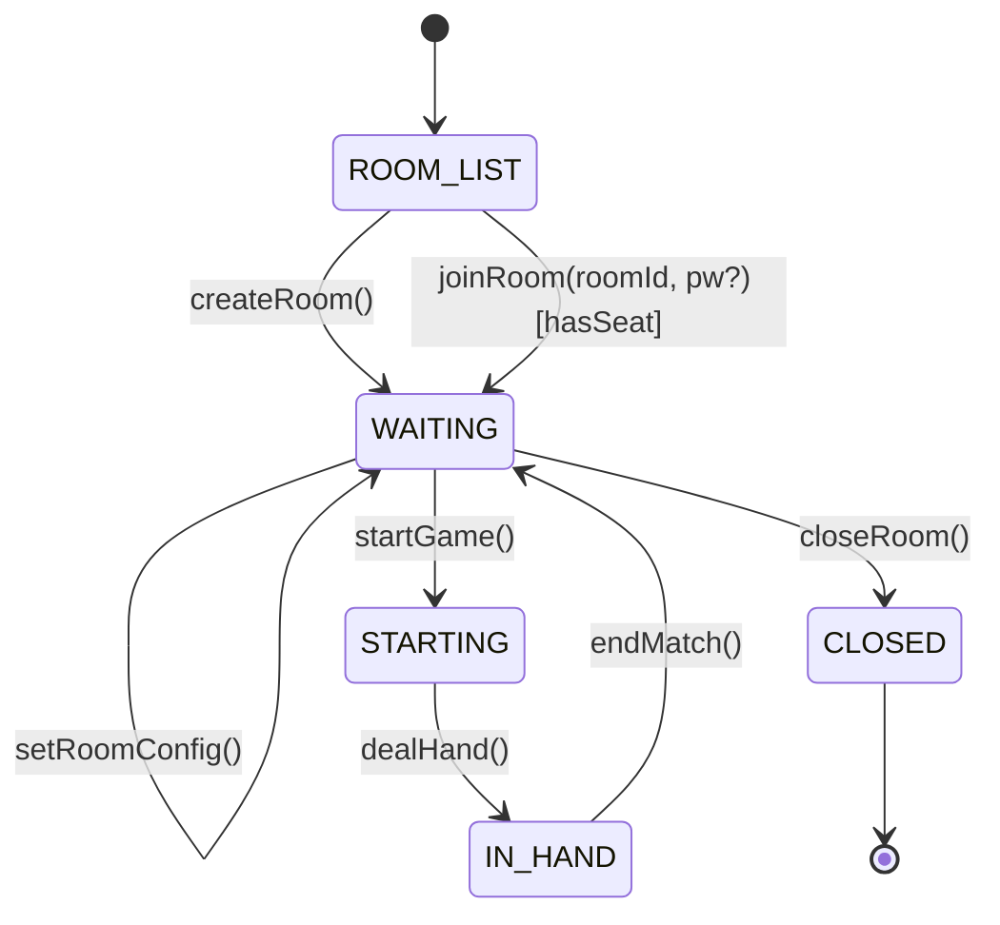
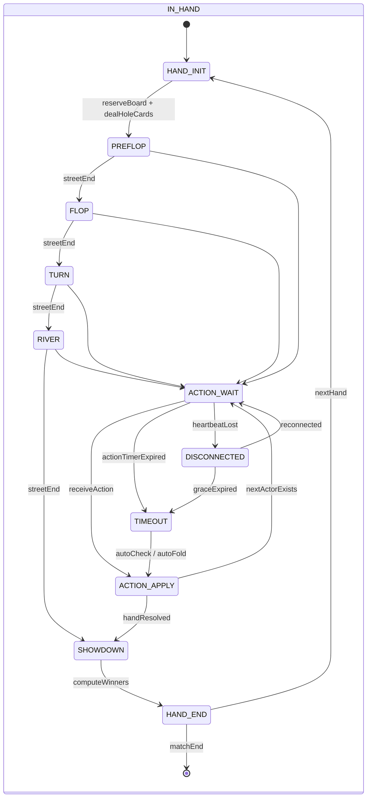

# Dense Deck Poker  
## オンライン対戦（PvP）要件整理  
### クローズドβ 1.0（MVP）

本ドキュメント群は、Dense Deck Poker における  
**オンライン対戦（PvP）導入に関する判断結果と仕様定義**をまとめたものである。

本フェーズでは以下を目的とする：

- ポーカーとして最低限成立するオンライン体験を提供する
- フルPvP（自動マッチング・高耐障害）は意図的に除外する
- 個人開発で実装・運用可能な重量に抑える
- 将来のフルPvPへの拡張余地を残す

本仕様は **クローズドβ 1.0（MVP）** を対象とする。

# 1. 判断結果とスコープ定義

## 1.1 背景

Dense Deck Poker は、  
「ポーカーである以上、人対人のオンライン性を持つべき」  
という思想を前提としている。

一方で、以下を同時に満たす **フルPvP** は、
MVP段階では過剰なコストを伴う。

- 自動マッチング
- 高度な切断耐性
- 不正対策
- 運営・モデレーション

## 1.2 判断結果

- ❌ フルPvPはMVP要件から除外
- ⭕ ルーム制オンライン対戦をMVPとして採用

## 1.3 MVPで目指す到達点

- 人 vs 人でハンドが成立する
- オンラインで同一状態が共有される
- Dense Deck の思想（判断密度・履歴重視）を壊さない

# 2. オンライン対戦モデル（β1.0）

## 2.1 基本方針

- ルーム制（マッチング無し）
- 最大4人（UTG / CO / BTN / BB）
- 招待制ではないが、完全公開でもない
- 観戦・途中参加は不可

## 2.2 採用しない要素（β1.0）

- 自動マッチング
- ランク / レーティング
- チャット
- 観戦
- 金銭価値・課金要素

# 3. ルーム仕様

## 3.1 ルーム作成・参加

- プレイヤーは以下を選択できる
  - 新規ルームを作成
  - 既存ルームに空きがあれば参加
- 参加可能状態は `WAITING` のみとする

## 3.2 ルーム種別

### PW無しルーム
- 誰でも参加可能

### PW付きルーム
- 参加時にパスワード入力が必要

※ PW有無はルーム作成時にのみ設定可能  
※ PWはハッシュ化して保存する

# 4. スタック仕様（クローズドβ 1.0）

## 4.1 初期スタック

- 入室時に **自動で200BBを付与**
- スタックはルーム単位の設定とする

```ts
roomConfig: {
  initialStackBB: 200
}
```

## 4.2 制約

- チップ補充は行わない
- 破産状態は考慮しない
- ハンド間でスタックは持ち越される
- 金銭的価値は一切持たない

# 5. 時間制限・切断対策

## 5.1 アクション時間制限

- 各アクションに固定制限時間（例：15〜20秒）
- タイムアウト時の処理
  - チェック可能 → autoCheck
  - チェック不可 → autoFold
- タイムバンクは導入しない

## 5.2 切断時処理

- heartbeat により切断を検知
- 猶予時間（例：30秒）以内の復帰は許可
- 猶予超過時はタイムアウト扱い
- 再接続は必須要件としない

# 6. ルーム状態遷移



## 補足ルール

- IN_HAND 中の参加・観戦は禁止
- ルームの破壊はハンド境界でのみ行う

# 7. ハンド進行状態遷移



# 8. MVP対象外（将来フェーズ）

以下はオープンβ以降に検討する。

- 自動マッチング
- ランク / レーティング
- 観戦
- チャット
- 高度な不正検知
- チップ経済・課金連動

# 9. ルームタグ仕様（MVP）

- ルーム作成時に、以下のタグを任意で1つ選択できる。
  - 初心者歓迎
  - 真剣勝負
  - 未設定（デフォルト）

- タグはルーム一覧にのみ表示される。
- 入室制限、マッチング、報酬、評価には影響しない。
- タグはルーム作成者の自己申告であり、
  システムによる検証・制裁は行わない。

- 本タグの目的は、
  プレイヤー間で「この卓で期待するプレイ姿勢」を共有することである。

# 10. 本仕様の位置づけ

本仕様は、

- オンラインポーカーとして最低限成立
- Dense Deck の思想を保持
- 個人開発で現実的な実装量

を満たす **意図的に削ぎ落としたオンラインMVP仕様**である。

将来のフルPvPは、
本仕様の上に段階的に積み上げることを前提とする。
